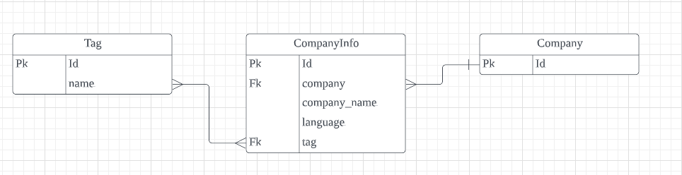

## 원티드 Company Search

## 과제 해석 [GoTo](https://www.notion.so/Wanted_Company_Search-5aa21858d1c24632a3f3811644b67414)
개별 회사 정보를 조회하는 api를 생성합니다. 회사명을 일부만 검색해도 자동완성하는 기능을 추가합니다.
* 배포 관련 부분은 미완성하였습니다. DB연결 시 생기는 에러는 추후 해결이 되면 고치겠습니다

### 기술 스택
  

### ERD

Model 설계:

개별 company안에 언어별 다른 정보가 포함되어 있습니다.
이를 구현하기 위해서 company와 companyinfo로 나누어 관리하였습니다. tag또한 언어별로 나누어
있지만, 테이블 추가 및 join이 많아져 성능 저하를 고려하여서, companyinfo 안에 manytomany로 묶었습니다.

### Step to run
~~~
.env 파일 생성 후 아래 정보를 담습니다
DB_NAME='DB이름'
DB_USER='유저이름'
DB_PASS='비밀번호'
DB_HOST='호스트주소'
~~~
~~~
1. python -m venv venv
2. venv\Scripts\activate.bat
3. pip install -r requirements
4. pyhon manage.py runserver
~~~

### Convention
Commit
- (add): 새로운 파일,폴더 추가
- (feat): 새로운 기능 추가
- (fix): 기존 소스 수정
